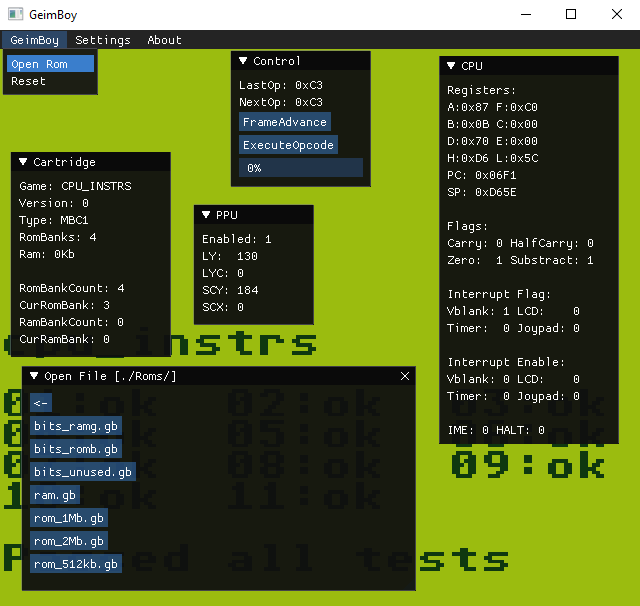
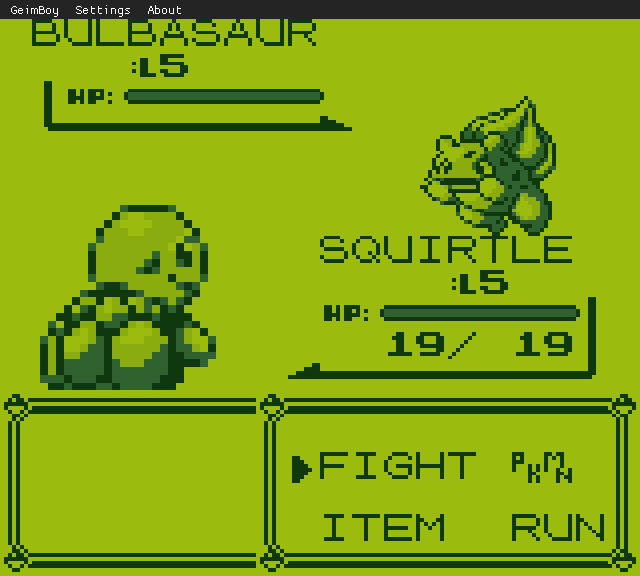
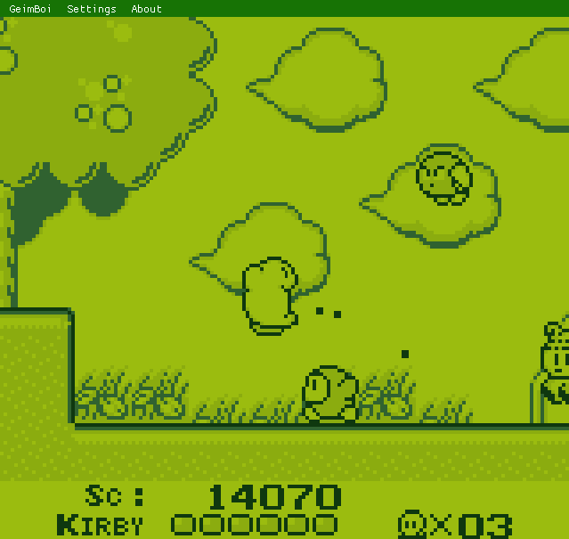

  

<h1 align=center> <b> GeimBoi </b> </h1>

**GeimBoi** is a GameBoy DMG emulator written in C++ using [SDL2](https://www.libsdl.org/download-2.0.php) and [ImGui](https://github.com/ocornut/imgui). GeimBoi was done as a programming exercise and to learn more about emulation. This Emulator isn't perfect by ANY means and HAS bugs.

## Building:
- **Windows:**  `(Visual Studio): should be just the matter of opening the GeimBoy.sln file an pressing compile. (assuming you have working c++ building environment.)`
- **Linux Arch:** `sudo pacman -S gcc make lib32-sdl2 boost && make -build=release -j4`

## Features:
- **MBC1:** support (passes Mooneye's mbc1 tests)
- **MBC2:** support (passes Mooneye's mbc2 tests)
- **MBC3:** support (both banking and realtime clock)
- **Saving:** roms with a battery gets it's ram dumbed into a *.sav file on exit and loaded on game power on.

## Todo:
- **Audio:** Audio emulation is currently WIP. Audio emulation is very primitive.
- **Accuracy:** This emulator is not currently timing/cycle accurate, and i'm not planning to make this 100% perfect, but atleast to pass some of the timing tests.
- **GBC Support:** GameBoy Color support down the line.
- **SaveState:** There're not currently savestates available.
- **GUI:** Lacks a lot of features.

## Screenshots:

## Credits:
### Libraries Used:
- [SDL2](https://www.libsdl.org/download-2.0.php) a cross-platform development library designed to provide low level access to audio, keyboard, mouse, joystick, and graphics hardware via OpenGL and Direct3D.
- [Dear ImGui](https://github.com/ocornut/imgui) a bloat-free graphical user interface library for C++.
- [Portable File Dialogs](https://github.com/samhocevar/portable-file-dialogs) simple to use crossplatform filedialogs.
- [toml++](https://github.com/marzer/tomlplusplus) TOML config parser and serializer for C++.
### Docs:
- [Pan Docs](https://gbdev.io/pandocs/) a technical reference guide for the GameBoy.
- [Gekkio's Complete Technical Guide](https://gekkio.fi/files/gb-docs/gbctr.pdf)